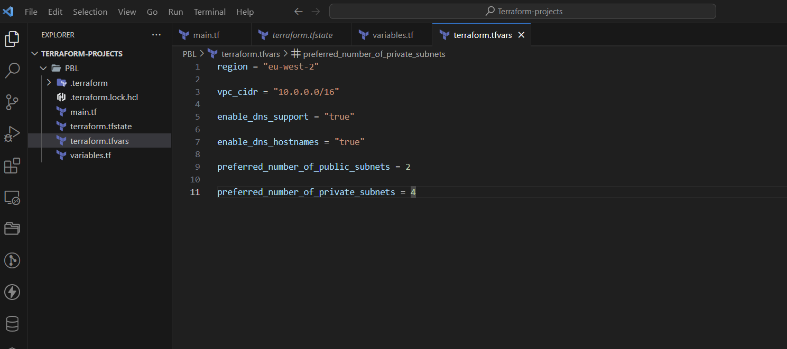
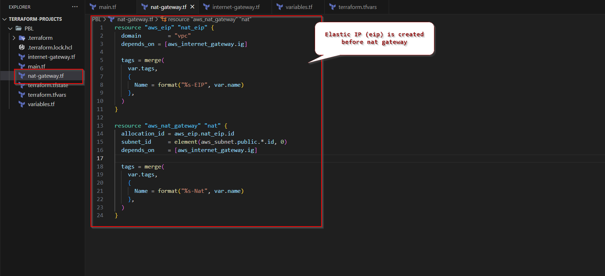

# Project-17
INFRASTRCTURE AS CODE (IaC) - AUTOMATE AWS CLOUD SOLUTION FOR 2 COMPANY WEBSITES USING A REVERSE PROXY TECHNOLOGY WITH TERRAFORM- PART 2

## Networking

**Private subnets & best practices**

Create 4 private subnets keeping in mind following principles:

- Make sure you use variables or *length()* function to determine the number of AZs
- Use variables and *cidrsubnet()* function to allocate vpc_cidr for subnets


- Keep variables and resources in separate files for better code structure and readability

 



- Tags all the resources you have created so far. Explore how to use *format()* and *count* functions to automatically tag subnets with its respective number.

Note: You can add multiple tags as a default set. for example, in our *terraform.tfvars* file we can have default tags defined.

```
tags = {
  Enviroment      = "production" 
  Owner-Email     = "alex@email.com"
  Managed-By      = "Terraform"
  Billing-Account = "1234567890"
}
```


Now you can tag all your resources using the format below:

On main.tf file, add this below the resources to be created 

```
tags = merge(
  var.tags,
  {
    Name = format("%s-PublicSubnet-%d", var.name, count.index)
  }
)
```


NOTE: Update the *variables.tf* to declare the variable tags used in the format above;

```
variable "tags" {
  description = "A mapping of tags to assign to all resources."
  type        = map(string)
  default     = {}
}
```


An advantage of this is - anytime we need to make a change to the tags, we simply do that in one single place *(terraform.tfvars)*.

### Internet Gateways & *format()* function

**Create an Internet Gateway in a separate Terraform file *internet_gateway.tf***

```
resource "aws_internet_gateway" "ig" {
  vpc_id = aws_vpc.main.id

  tags = merge(
    var.tags,
    {
      Name = format("%s-%s!", aws_vpc.main.id,"IG")
    } 
  )
}
```
Here, we have used *format()* function to dynamically generate a unique name for this resource? The first part of the %s takes the interpolated value of *aws_vpc.main.id* while the second *%s* appends a literal string *IG* and finally an exclamation mark is added in the end.


### NAT Gateways

**Create 1 NAT Gateways and 1 Elastic IP (EIP) addresses**

create a new file called *natgateway.tf*

**Note:** We need to create an Elastic IP for the NAT Gateway, and make use of *depends_on* to indicate that the Internet Gateway resource must be available before this (nat gateway) should be created. Although Terraform does a good job to manage dependencies, but in some cases, it is good to be explicit.

input into *natgateway.tf*

```
resource "aws_eip" "nat_eip" {
  domain        = "vpc"
  depends_on = [aws_internet_gateway.ig]

  tags = merge(
    var.tags,
    {
      Name = format("%s-EIP", var.name)
    },
  )
}

resource "aws_nat_gateway" "nat" {
  allocation_id = aws_eip.nat_eip.id
  subnet_id     = element(aws_subnet.public.*.id, 0)
  depends_on    = [aws_internet_gateway.ig]

  tags = merge(
    var.tags,
    {
      Name = format("%s-Nat", var.name)
    },
  )
}

```


the code block above was derived from [Terraform documentation](https://registry.terraform.io/providers/hashicorp/aws/latest/docs/resources/nat_gateway) whihc can be tailored to suit or specific arguments.

Run *terraform Plan* to see that the code block has no errors.

## AWS ROUTES

Create a file called *route_tables.tf* and use it to create routes for both public and private subnets, create the below resources. Ensure they are properly tagged.

- aws_route_table
- aws_route
- aws_route_table_association

```
# create private route table
resource "aws_route_table" "private-rtb" {
  vpc_id = aws_vpc.main.id

  tags = merge(
    var.tags,
    {
      Name = format("%s-Private-Route-Table", var.name)
    },
  )
}

# associate all private subnets to the private route table
resource "aws_route_table_association" "private-subnets-assoc" {
  count          = length(aws_subnet.private[*].id)
  subnet_id      = element(aws_subnet.private[*].id, count.index)
  route_table_id = aws_route_table.private-rtb.id
}

# create route table for the public subnets
resource "aws_route_table" "public-rtb" {
  vpc_id = aws_vpc.main.id

  tags = merge(
    var.tags,
    {
      Name = format("%s-Public-Route-Table", var.name)
    },
  )
}

# create route for the public route table and attach the internet gateway
resource "aws_route" "public-rtb-route" {
  route_table_id         = aws_route_table.public-rtb.id
  destination_cidr_block = "0.0.0.0/0"
  gateway_id             = aws_internet_gateway.ig.id
}

# associate all public subnets to the public route table
resource "aws_route_table_association" "public-subnets-assoc" {
  count          = length(aws_subnet.public[*].id)
  subnet_id      = element(aws_subnet.public[*].id, count.index)
  route_table_id = aws_route_table.public-rtb.id
}
```

Now if we run terraform plan and terraform apply it will add the following resources to AWS in multi-az set up:


-- Our main vpc

-– 2 Public subnets

-– 4 Private subnets

–- 1 Internet Gateway

-– 1 NAT Gateway

-– 1 EIP

-– 2 Route tables

We are pretty much done with Identity and Management part for now, let us move on and create other resources required.

Resources to be created
As per our architecture we need to do the following:

1. Create Security Groups
1. Create Target Group for Nginx, WordPress and Tooling
1. Create certificate from AWS certificate manager
1. Create an External Application Load Balancer and Internal Application Load Balancer.
1. create launch template for Bastion, Tooling, Nginx and WordPress
1. Create an Auto Scaling Group (ASG) for Bastion, Tooling, Nginx and WordPress
1. Create Elastic Filesystem
1. Create Relational Database (RDS)

Let us create some Terraform configuration code to accomplish these tasks.

## CREATE SECURITY GROUPS

We are going to create all the security groups in a single file, then we are going to refrence this security group within each resources that needs it.

**IMPORTANT:**

- Check out the terraform documentation for security group [here](https://registry.terraform.io/providers/hashicorp/aws/latest/docs/resources/security_group)

- Check out the terraform documentation for security group rule [here](https://registry.terraform.io/providers/hashicorp/aws/latest/docs/resources/security_group_rule)

Create a file and name it *security.tf*, copy and paste the code below:

```
# security group for alb, to allow acess from any where for HTTP and HTTPS traffic
resource "aws_security_group" "ext-alb-sg" {
  name        = "ext-alb-sg"
  vpc_id      = aws_vpc.main.id
  description = "Allow TLS inbound traffic"

  ingress {
    description = "HTTP"
    from_port   = 80
    to_port     = 80
    protocol    = "tcp"
    cidr_blocks = ["0.0.0.0/0"]
  }

  ingress {
    description = "HTTPS"
    from_port   = 443
    to_port     = 443
    protocol    = "tcp"
    cidr_blocks = ["0.0.0.0/0"]
  }

  egress {
    from_port   = 0
    to_port     = 0
    protocol    = "-1"
    cidr_blocks = ["0.0.0.0/0"]
  }

 tags = merge(
    var.tags,
    {
      Name = "ext-alb-sg"
    },
  )

}

# security group for bastion, to allow access into the bastion host from you IP
resource "aws_security_group" "bastion_sg" {
  name        = "vpc_web_sg"
  vpc_id = aws_vpc.main.id
  description = "Allow incoming HTTP connections."

  ingress {
    description = "SSH"
    from_port   = 22
    to_port     = 22
    protocol    = "tcp"
    cidr_blocks = ["0.0.0.0/0"]
  }

  egress {
    from_port   = 0
    to_port     = 0
    protocol    = "-1"
    cidr_blocks = ["0.0.0.0/0"]
  }

   tags = merge(
    var.tags,
    {
      Name = "Bastion-SG"
    },
  )
}

#security group for nginx reverse proxy, to allow access only from the extaernal load balancer and bastion instance
resource "aws_security_group" "nginx-sg" {
  name   = "nginx-sg"
  vpc_id = aws_vpc.main.id

  egress {
    from_port   = 0
    to_port     = 0
    protocol    = "-1"
    cidr_blocks = ["0.0.0.0/0"]
  }

   tags = merge(
    var.tags,
    {
      Name = "nginx-SG"
    },
  )
}

resource "aws_security_group_rule" "inbound-nginx-http" {
  type                     = "ingress"
  from_port                = 443
  to_port                  = 443
  protocol                 = "tcp"
  source_security_group_id = aws_security_group.ext-alb-sg.id
  security_group_id        = aws_security_group.nginx-sg.id
}

resource "aws_security_group_rule" "inbound-bastion-ssh" {
  type                     = "ingress"
  from_port                = 22
  to_port                  = 22
  protocol                 = "tcp"
  source_security_group_id = aws_security_group.bastion_sg.id
  security_group_id        = aws_security_group.nginx-sg.id
}

# security group for ialb, to have acces only from nginx reverser proxy server
resource "aws_security_group" "int-alb-sg" {
  name   = "my-alb-sg"
  vpc_id = aws_vpc.main.id

  egress {
    from_port   = 0
    to_port     = 0
    protocol    = "-1"
    cidr_blocks = ["0.0.0.0/0"]
  }

  tags = merge(
    var.tags,
    {
      Name = "int-alb-sg"
    },
  )

}

resource "aws_security_group_rule" "inbound-ialb-https" {
  type                     = "ingress"
  from_port                = 443
  to_port                  = 443
  protocol                 = "tcp"
  source_security_group_id = aws_security_group.nginx-sg.id
  security_group_id        = aws_security_group.int-alb-sg.id
}

# security group for webservers, to have access only from the internal load balancer and bastion instance
resource "aws_security_group" "webserver-sg" {
  name   = "my-asg-sg"
  vpc_id = aws_vpc.main.id

  egress {
    from_port   = 0
    to_port     = 0
    protocol    = "-1"
    cidr_blocks = ["0.0.0.0/0"]
  }

  tags = merge(
    var.tags,
    {
      Name = "webserver-sg"
    },
  )

}

resource "aws_security_group_rule" "inbound-web-https" {
  type                     = "ingress"
  from_port                = 443
  to_port                  = 443
  protocol                 = "tcp"
  source_security_group_id = aws_security_group.int-alb-sg.id
  security_group_id        = aws_security_group.webserver-sg.id
}

resource "aws_security_group_rule" "inbound-web-ssh" {
  type                     = "ingress"
  from_port                = 22
  to_port                  = 22
  protocol                 = "tcp"
  source_security_group_id = aws_security_group.bastion_sg.id
  security_group_id        = aws_security_group.webserver-sg.id
}

# security group for datalayer to alow traffic from websever on nfs and mysql port and bastiopn host on mysql port
resource "aws_security_group" "datalayer-sg" {
  name   = "datalayer-sg"
  vpc_id = aws_vpc.main.id

  egress {
    from_port   = 0
    to_port     = 0
    protocol    = "-1"
    cidr_blocks = ["0.0.0.0/0"]
  }

 tags = merge(
    var.tags,
    {
      Name = "datalayer-sg"
    },
  )
}

resource "aws_security_group_rule" "inbound-nfs-port" {
  type                     = "ingress"
  from_port                = 2049
  to_port                  = 2049
  protocol                 = "tcp"
  source_security_group_id = aws_security_group.webserver-sg.id
  security_group_id        = aws_security_group.datalayer-sg.id
}

resource "aws_security_group_rule" "inbound-mysql-bastion" {
  type                     = "ingress"
  from_port                = 3306
  to_port                  = 3306
  protocol                 = "tcp"
  source_security_group_id = aws_security_group.bastion_sg.id
  security_group_id        = aws_security_group.datalayer-sg.id
}

resource "aws_security_group_rule" "inbound-mysql-webserver" {
  type                     = "ingress"
  from_port                = 3306
  to_port                  = 3306
  protocol                 = "tcp"
  source_security_group_id = aws_security_group.webserver-sg.id
  security_group_id        = aws_security_group.datalayer-sg.id
}
```

