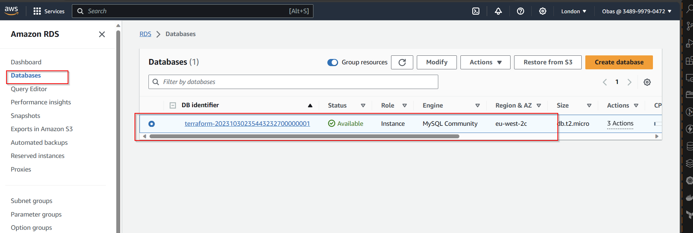

INFRASTRCTURE AS CODE (IaC) - AUTOMATE AWS CLOUD SOLUTION FOR 2 COMPANY WEBSITES USING A REVERSE PROXY TECHNOLOGY WITH TERRAFORM- PART 2


## Networking

**Private subnets & best practices**

Create 4 private subnets keeping in mind following principles:

- Make sure you use variables or *length()* function to determine the number of AZs
- Use variables and *cidrsubnet()* function to allocate vpc_cidr for subnets


- Keep variables and resources in separate files for better code structure and readability

 


- Tags all the resources you have created so far. Explore how to use *format()* and *count* functions to automatically tag subnets with its respective number.

Note: You can add multiple tags as a default set. for example, in our *terraform.tfvars* file we can have default tags defined.

```
tags = {
  Enviroment      = "production" 
  Owner-Email     = "alex@email.com"
  Managed-By      = "Terraform"
  Billing-Account = "1234567890"
}
```


Now you can tag all your resources using the format below:

On main.tf file, add this below the resources to be created 

```
tags = merge(
  var.tags,
  {
    Name = format("%s-PublicSubnet-%d", var.name, count.index)
  }
)
```


NOTE: Update the *variables.tf* to declare the variable tags used in the format above;

```
variable "tags" {
  description = "A mapping of tags to assign to all resources."
  type        = map(string)
  default     = {}
}
```


An advantage of this is - anytime we need to make a change to the tags, we simply do that in one single place *(terraform.tfvars)*.

### Internet Gateways & *format()* function

**Create an Internet Gateway in a separate Terraform file *internet_gateway.tf***

```
resource "aws_internet_gateway" "ig" {
  vpc_id = aws_vpc.main.id

  tags = merge(
    var.tags,
    {
      Name = format("%s-%s!", aws_vpc.main.id,"IG")
    } 
  )
}
```
Here, we have used *format()* function to dynamically generate a unique name for this resource? The first part of the %s takes the interpolated value of *aws_vpc.main.id* while the second *%s* appends a literal string *IG* and finally an exclamation mark is added in the end.


### NAT Gateways

**Create 1 NAT Gateways and 1 Elastic IP (EIP) addresses**

create a new file called *natgateway.tf*

**Note:** We need to create an Elastic IP for the NAT Gateway, and make use of *depends_on* to indicate that the Internet Gateway resource must be available before this (nat gateway) should be created. Although Terraform does a good job to manage dependencies, but in some cases, it is good to be explicit.

input into *natgateway.tf*

```
resource "aws_eip" "nat_eip" {
  domain        = "vpc"
  depends_on = [aws_internet_gateway.ig]

  tags = merge(
    var.tags,
    {
      Name = format("%s-EIP", var.name)
    },
  )
}

resource "aws_nat_gateway" "nat" {
  allocation_id = aws_eip.nat_eip.id
  subnet_id     = element(aws_subnet.public.*.id, 0)
  depends_on    = [aws_internet_gateway.ig]

  tags = merge(
    var.tags,
    {
      Name = format("%s-Nat", var.name)
    },
  )
}

```


the code block above was derived from [Terraform documentation](https://registry.terraform.io/providers/hashicorp/aws/latest/docs/resources/nat_gateway) whihc can be tailored to suit or specific arguments.

Run *terraform Plan* to see that the code block has no errors.

## AWS ROUTES

Create a file called *route_tables.tf* and use it to create routes for both public and private subnets, create the below resources. Ensure they are properly tagged.

- aws_route_table
- aws_route
- aws_route_table_association

```
# create private route table
resource "aws_route_table" "private-rtb" {
  vpc_id = aws_vpc.main.id

  tags = merge(
    var.tags,
    {
      Name = format("%s-Private-Route-Table", var.name)
    },
  )
}

# associate all private subnets to the private route table
resource "aws_route_table_association" "private-subnets-assoc" {
  count          = length(aws_subnet.private[*].id)
  subnet_id      = element(aws_subnet.private[*].id, count.index)
  route_table_id = aws_route_table.private-rtb.id
}

# create route table for the public subnets
resource "aws_route_table" "public-rtb" {
  vpc_id = aws_vpc.main.id

  tags = merge(
    var.tags,
    {
      Name = format("%s-Public-Route-Table", var.name)
    },
  )
}

# create route for the public route table and attach the internet gateway
resource "aws_route" "public-rtb-route" {
  route_table_id         = aws_route_table.public-rtb.id
  destination_cidr_block = "0.0.0.0/0"
  gateway_id             = aws_internet_gateway.ig.id
}

# associate all public subnets to the public route table
resource "aws_route_table_association" "public-subnets-assoc" {
  count          = length(aws_subnet.public[*].id)
  subnet_id      = element(aws_subnet.public[*].id, count.index)
  route_table_id = aws_route_table.public-rtb.id
}
```

Now if we run terraform plan and terraform apply it will add the following resources to AWS in multi-az set up:


-- Our main vpc

-– 2 Public subnets

-– 4 Private subnets

–- 1 Internet Gateway

-– 1 NAT Gateway

-– 1 EIP

-– 2 Route tables

**Now, we are done with Networking part of AWS set up, let us move on to Compute and Access Control configuration automation using Terraform!**


### [IaM](https://docs.aws.amazon.com/iam/index.html) and [Roles](https://docs.aws.amazon.com/IAM/latest/UserGuide/id_roles.html)

We want to pass an IAM role our EC2 instances to give them access to some specific resources, so we need to do the following:

1. Create [AssumeRole](https://docs.aws.amazon.com/STS/latest/APIReference/API_AssumeRole.html)

Assume Role uses Security Token Service (STS) API that returns a set of temporary security credentials that you can use to access AWS resources that you might not normally have access to. These temporary credentials consist of an access key ID, a secret access key, and a security token. Typically, you use *AssumeRole* within your account or for cross-account access.

Create a *roles.tf* file and add the following code to  the *roles.tf*

```
resource "aws_iam_role" "ec2_instance_role" {
name = "ec2_instance_role"
  assume_role_policy = jsonencode({
    Version = "2012-10-17"
    Statement = [
      {
        Action = "sts:AssumeRole"
        Effect = "Allow"
        Sid    = ""
        Principal = {
          Service = "ec2.amazonaws.com"
        }
      },
    ]
  })

  tags = merge(
    var.tags,
    {
      Name = "aws assume role"
    },
  )
}

```
In this code we are creating AssumeRole with AssumeRole policy. It grants to an entity, in our case an EC2, permissions to assume the role.

2. Create [IAM policy](https://docs.aws.amazon.com/IAM/latest/UserGuide/access_policies_create.html) for this role.

We do this to define a required policy (i.e., permissions) according to our requirements. For example, allowing an IAM role to perform the action *describe* applied to EC2 instances:

```
resource "aws_iam_policy" "policy" {
  name        = "ec2_instance_policy"
  description = "A test policy"
  policy = jsonencode({
    Version = "2012-10-17"
    Statement = [
      {
        Action = [
          "ec2:Describe*",
        ]
        Effect   = "Allow"
        Resource = "*"
      },
    ]

  })

  tags = merge(
    var.tags,
    {
      Name =  "aws assume policy"
    },
  )

}

```

3. Attach the *Policy* to the *IAM Role*

This is where, we will be attaching the policy which we created above, to the role we created in the first step.

```
   resource "aws_iam_role_policy_attachment" "test-attach" {
        role       = aws_iam_role.ec2_instance_role.name
        policy_arn = aws_iam_policy.policy.arn
    }
```

4. Create an Instance Profile and interpolate the *IAM Role*

```
 resource "aws_iam_instance_profile" "ip" {
        name = "aws_instance_profile_test"
        role =  aws_iam_role.ec2_instance_role.name
    }
```


We are pretty much done with Identity and Management part for now, let us move on and create other resources required.

Resources to be created
As per our architecture we need to do the following:

1. Create Security Groups
1. Create Target Group for Nginx, WordPress and Tooling
1. Create certificate from AWS certificate manager
1. Create an External Application Load Balancer and Internal Application Load Balancer.
1. create launch template for Bastion, Tooling, Nginx and WordPress
1. Create an Auto Scaling Group (ASG) for Bastion, Tooling, Nginx and WordPress
1. Create Elastic Filesystem
1. Create Relational Database (RDS)

Let us create some Terraform configuration code to accomplish these tasks.

## CREATE SECURITY GROUPS

We are going to create all the security groups in a single file, then we are going to refrence this security group within each resources that needs it.

**IMPORTANT:**

- Check out the terraform documentation for security group [here](https://registry.terraform.io/providers/hashicorp/aws/latest/docs/resources/security_group)

- Check out the terraform documentation for security group rule [here](https://registry.terraform.io/providers/hashicorp/aws/latest/docs/resources/security_group_rule)

Create a file and name it *security.tf*, copy and paste the code below:

```
# security group for alb, to allow acess from any where for HTTP and HTTPS traffic
resource "aws_security_group" "ext-alb-sg" {
  name        = "ext-alb-sg"
  vpc_id      = aws_vpc.main.id
  description = "Allow TLS inbound traffic"

  ingress {
    description = "HTTP"
    from_port   = 80
    to_port     = 80
    protocol    = "tcp"
    cidr_blocks = ["0.0.0.0/0"]
  }

  ingress {
    description = "HTTPS"
    from_port   = 443
    to_port     = 443
    protocol    = "tcp"
    cidr_blocks = ["0.0.0.0/0"]
  }

  egress {
    from_port   = 0
    to_port     = 0
    protocol    = "-1"
    cidr_blocks = ["0.0.0.0/0"]
  }

 tags = merge(
    var.tags,
    {
      Name = "ext-alb-sg"
    },
  )

}

# security group for bastion, to allow access into the bastion host from you IP
resource "aws_security_group" "bastion_sg" {
  name        = "bastion_sg"
  vpc_id = aws_vpc.main.id
  description = "Allow incoming HTTP connections."

  ingress {
    description = "SSH"
    from_port   = 22
    to_port     = 22
    protocol    = "tcp"
    cidr_blocks = ["0.0.0.0/0"]
  }

  egress {
    from_port   = 0
    to_port     = 0
    protocol    = "-1"
    cidr_blocks = ["0.0.0.0/0"]
  }

   tags = merge(
    var.tags,
    {
      Name = "Bastion-SG"
    },
  )
}

#security group for nginx reverse proxy, to allow access only from the extaernal load balancer and bastion instance
resource "aws_security_group" "nginx-sg" {
  name   = "nginx-sg"
  vpc_id = aws_vpc.main.id

  egress {
    from_port   = 0
    to_port     = 0
    protocol    = "-1"
    cidr_blocks = ["0.0.0.0/0"]
  }

   tags = merge(
    var.tags,
    {
      Name = "nginx-SG"
    },
  )
}

resource "aws_security_group_rule" "inbound-nginx-http" {
  type                     = "ingress"
  from_port                = 443
  to_port                  = 443
  protocol                 = "tcp"
  source_security_group_id = aws_security_group.ext-alb-sg.id
  security_group_id        = aws_security_group.nginx-sg.id
}

resource "aws_security_group_rule" "inbound-bastion-ssh" {
  type                     = "ingress"
  from_port                = 22
  to_port                  = 22
  protocol                 = "tcp"
  source_security_group_id = aws_security_group.bastion_sg.id
  security_group_id        = aws_security_group.nginx-sg.id
}

# security group for ialb, to have acces only from nginx reverser proxy server
resource "aws_security_group" "int-alb-sg" {
  name   = "Int-alb-sg"
  vpc_id = aws_vpc.main.id

  egress {
    from_port   = 0
    to_port     = 0
    protocol    = "-1"
    cidr_blocks = ["0.0.0.0/0"]
  }

  tags = merge(
    var.tags,
    {
      Name = "int-alb-sg"
    },
  )

}

resource "aws_security_group_rule" "inbound-ialb-https" {
  type                     = "ingress"
  from_port                = 443
  to_port                  = 443
  protocol                 = "tcp"
  source_security_group_id = aws_security_group.nginx-sg.id
  security_group_id        = aws_security_group.int-alb-sg.id
}

# security group for webservers, to have access only from the internal load balancer and bastion instance
resource "aws_security_group" "webserver-sg" {
  name   = "weserver-sg"
  vpc_id = aws_vpc.main.id

  egress {
    from_port   = 0
    to_port     = 0
    protocol    = "-1"
    cidr_blocks = ["0.0.0.0/0"]
  }

  tags = merge(
    var.tags,
    {
      Name = "webserver-sg"
    },
  )

}

resource "aws_security_group_rule" "inbound-web-https" {
  type                     = "ingress"
  from_port                = 443
  to_port                  = 443
  protocol                 = "tcp"
  source_security_group_id = aws_security_group.int-alb-sg.id
  security_group_id        = aws_security_group.webserver-sg.id
}

resource "aws_security_group_rule" "inbound-web-ssh" {
  type                     = "ingress"
  from_port                = 22
  to_port                  = 22
  protocol                 = "tcp"
  source_security_group_id = aws_security_group.bastion_sg.id
  security_group_id        = aws_security_group.webserver-sg.id
}

# security group for datalayer to alow traffic from websever on nfs and mysql port and bastiopn host on mysql port
resource "aws_security_group" "datalayer-sg" {
  name   = "datalayer-sg"
  vpc_id = aws_vpc.main.id

  egress {
    from_port   = 0
    to_port     = 0
    protocol    = "-1"
    cidr_blocks = ["0.0.0.0/0"]
  }

 tags = merge(
    var.tags,
    {
      Name = "datalayer-sg"
    },
  )
}

resource "aws_security_group_rule" "inbound-nfs-port" {
  type                     = "ingress"
  from_port                = 2049
  to_port                  = 2049
  protocol                 = "tcp"
  source_security_group_id = aws_security_group.webserver-sg.id
  security_group_id        = aws_security_group.datalayer-sg.id
}

resource "aws_security_group_rule" "inbound-mysql-bastion" {
  type                     = "ingress"
  from_port                = 3306
  to_port                  = 3306
  protocol                 = "tcp"
  source_security_group_id = aws_security_group.bastion_sg.id
  security_group_id        = aws_security_group.datalayer-sg.id
}

resource "aws_security_group_rule" "inbound-mysql-webserver" {
  type                     = "ingress"
  from_port                = 3306
  to_port                  = 3306
  protocol                 = "tcp"
  source_security_group_id = aws_security_group.webserver-sg.id
  security_group_id        = aws_security_group.datalayer-sg.id
}
```


**IMPORTANT NOTE:**  We used the aws_security_group_rule to refrence another security group in a security group

1. **External Application Load Balancer (ALB) Security Group (ext-alb-sg):**

Allows inbound HTTP (port 80) and HTTPS (port 443) traffic from anywhere.
Allows all outbound traffic.

2. **Bastion Host Security Group (bastion_sg):**

Allows inbound SSH (port 22) traffic from anywhere.
Allows all outbound traffic.

3. **Nginx Reverse Proxy Security Group (nginx-sg):**

No inbound rules defined, meaning no external traffic is allowed by default.
Allows all outbound traffic.

4. **Ingress Rules for Nginx Reverse Proxy:**

Opens port 443 for HTTPS traffic from the External ALB (ext-alb-sg).
Opens port 22 for SSH traffic from the Bastion Host (bastion_sg).

5. **Internal Application Load Balancer (ALB) Security Group (int-alb-sg):**

No inbound rules defined, meaning no external traffic is allowed by default.
Allows all outbound traffic.

6. **Ingress Rule for Internal ALB:**

Opens port 443 for HTTPS traffic from the Nginx Reverse Proxy (nginx-sg).

7. **Web Server Security Group (webserver-sg):**

No inbound rules defined, meaning no external traffic is allowed by default.
Allows all outbound traffic.

8. **Ingress Rules for Web Servers:**

Opens port 443 for HTTPS traffic from the Internal ALB (int-alb-sg).
Opens port 22 for SSH traffic from the Bastion Host (bastion_sg).

9. **Data Layer Security Group (datalayer-sg):**

No inbound rules defined, meaning no external traffic is allowed by default.
Allows all outbound traffic.

10. **Ingress Rules for Data Layer:**

Opens port 2049 for NFS traffic from Web Servers (webserver-sg).
Opens port 3306 for MySQL traffic from both the Bastion Host (bastion_sg) and Web Servers (webserver-sg).

These security groups are designed to control and secure traffic between the different components of your infrastructure. They follow the principle of least privilege, meaning they only allow necessary traffic to pass through.


## CREATE CERTIFICATE FROM AMAZON CERIFICATE MANAGER (ACM)

Create *cert.tf* file and add the following code snippets to it.

**NOTE:** Check carefully to change the domain name to your own domain name and every other name that needs to be changed.

Check out the terraform documentation for [AWS Certificate manager](https://registry.terraform.io/providers/hashicorp/aws/latest/docs/resources/acm_certificate) 

```
# The entire section create a certificate, public zone, and validate the certificate using DNS method

# Create the certificate using a wildcard for all the domains created in alextools.info
resource "aws_acm_certificate" "alextools" {
  domain_name       = "*.alextools.info"
  validation_method = "DNS"
}

# calling the hosted zone
data "aws_route53_zone" "alextools" {
  name         = "alextools.info"
  private_zone = false
}

# selecting validation method
resource "aws_route53_record" "alextools" {
  for_each = {
    for dvo in aws_acm_certificate.alextools.domain_validation_options : dvo.domain_name => {
      name   = dvo.resource_record_name
      record = dvo.resource_record_value
      type   = dvo.resource_record_type
    }
  }

  allow_overwrite = true
  name            = each.value.name
  records         = [each.value.record]
  ttl             = 60
  type            = each.value.type
  zone_id         = data.aws_route53_zone.alextools.zone_id
}

# validate the certificate through DNS method
resource "aws_acm_certificate_validation" "alextools" {
  certificate_arn         = aws_acm_certificate.alextools.arn
  validation_record_fqdns = [for record in aws_route53_record.alextools : record.fqdn]
}

# create records for tooling
resource "aws_route53_record" "tooling" {
  zone_id = data.aws_route53_zone.alextools.zone_id
  name    = "tooling.alextools.info"
  type    = "A"

  alias {
    name                   = aws_lb.ext-alb.dns_name
    zone_id                = aws_lb.ext-alb.zone_id
    evaluate_target_health = true
  }
}

# create records for wordpress
resource "aws_route53_record" "wordpress" {
  zone_id = data.aws_route53_zone.alextools.zone_id
  name    = "wordpress.alextools.info"
  type    = "A"

  alias {
    name                   = aws_lb.ext-alb.dns_name
    zone_id                = aws_lb.ext-alb.zone_id
    evaluate_target_health = true
  }
}

```


At this stage, If we run *terraform apply* it will fail because we have not declared the load balancer *ext-lb* in the root module. to solve this, we must create a load balancer file *alb.tf* in the root module and input the terraform configuration code for load balancer

### Create an external (Internet facing) Application Load Balancer (ALB)

Create a file called *alb.tf*

First of all we will:

- [Create the ALB,](https://registry.terraform.io/providers/hashicorp/aws/latest/docs/resources/lb) then we 
- [Create the target group,](https://registry.terraform.io/providers/hashicorp/aws/latest/docs/resources/lb_target_group) and lastly, 
- [Create the listener rule.](https://registry.terraform.io/providers/hashicorp/aws/latest/docs/resources/lb_listener)

Useful Terraform Documentation, go through this documentation and understand the arguement needed for each resources:


**Create External ALB** - We need to create an ALB to balance the traffic between the Instances:

```
resource "aws_lb" "ext-alb" {
  name     = "ext-alb"
  internal = false
  security_groups = [
    aws_security_group.ext-alb-sg.id,
  ]

  subnets = [
    aws_subnet.public[0].id,
    aws_subnet.public[1].id
  ]

   tags = merge(
    var.tags,
    {
      Name = "ATEK-ext-alb"
    },
  )

  ip_address_type    = "ipv4"
  load_balancer_type = "application"
}
```


**Create target group** - To inform our ALB of where to route the traffic to, we need to create a Target Group to point to its targets.

```
resource "aws_lb_target_group" "nginx-tgt" {
  health_check {
    interval            = 10
    path                = "/healthstatus"
    protocol            = "HTTPS"
    timeout             = 5
    healthy_threshold   = 5
    unhealthy_threshold = 2
  }
  name        = "nginx-tgt"
  port        = 443
  protocol    = "HTTPS"
  target_type = "instance"
  vpc_id      = aws_vpc.main.id
}
```


**Create listener rule** - We will need to create a Listner for this target group

```
resource "aws_lb_listener" "nginx-listner" {
  load_balancer_arn = aws_lb.ext-alb.arn
  port              = 443
  protocol          = "HTTPS"
  certificate_arn   = aws_acm_certificate_validation.oyindamola.certificate_arn

  default_action {
    type             = "forward"
    target_group_arn = aws_lb_target_group.nginx-tgt.arn
  }
}
```


Add the following outputs to *output.tf* to print them on screen

```
output "alb_dns_name" {
  value = aws_lb.ext-alb.dns_name
}

output "alb_target_group_arn" {
  value = aws_lb_target_group.nginx-tgt.arn
}

```


### Create an Internal (Internal) Application Load Balancer (ALB)

For the Internal Load balancer we will follow the same concepts with the external load balancer.

Add the code snippets inside the *alb.tf* file

```
resource "aws_lb" "ialb" {
  name     = "ialb"
  internal = true
  security_groups = [
    aws_security_group.int-alb-sg.id,
  ]

  subnets = [
    aws_subnet.private[0].id,
    aws_subnet.private[1].id
  ]

  tags = merge(
    var.tags,
    {
      Name = "ATEK-int-alb"
    },
  )

  ip_address_type    = "ipv4"
  load_balancer_type = "application"
}

```


To inform our ALB to where to route the traffic to , we need to create a *Target Group* to point to its targets:

```
# --- target group  for wordpress -------

resource "aws_lb_target_group" "wordpress-tgt" {
  health_check {
    interval            = 10
    path                = "/healthstatus"
    protocol            = "HTTPS"
    timeout             = 5
    healthy_threshold   = 5
    unhealthy_threshold = 2
  }

  name        = "wordpress-tgt"
  port        = 443
  protocol    = "HTTPS"
  target_type = "instance"
  vpc_id      = aws_vpc.main.id
}

# --- target group for tooling -------

resource "aws_lb_target_group" "tooling-tgt" {
  health_check {
    interval            = 10
    path                = "/healthstatus"
    protocol            = "HTTPS"
    timeout             = 5
    healthy_threshold   = 5
    unhealthy_threshold = 2
  }

  name        = "tooling-tgt"
  port        = 443
  protocol    = "HTTPS"
  target_type = "instance"
  vpc_id      = aws_vpc.main.id
}

```


Then we will need to create a Listner for this target Group

```
# For this aspect a single listener was created for the wordpress which is default,
# A rule was created to route traffic to tooling when the host header changes

resource "aws_lb_listener" "web-listener" {
  load_balancer_arn = aws_lb.ialb.arn
  port              = 443
  protocol          = "HTTPS"
  certificate_arn   = aws_acm_certificate_validation.oyindamola.certificate_arn

  default_action {
    type             = "forward"
    target_group_arn = aws_lb_target_group.wordpress-tgt.arn
  }
}

# listener rule for tooling target

resource "aws_lb_listener_rule" "tooling-listener" {
  listener_arn = aws_lb_listener.web-listener.arn
  priority     = 99

  action {
    type             = "forward"
    target_group_arn = aws_lb_target_group.tooling-tgt.arn
  }

  condition {
    host_header {
      values = ["tooling.oyindamola.gq"]
    }
  }
}

```


Run a *terraform plan* and *terraform apply* to check all resources will be created without error. Then check out your AWS console for the resources created.


## CREATING AUSTOALING GROUPS

**In this section we will create the [Auto Scaling Group (ASG)](https://docs.aws.amazon.com/autoscaling/ec2/userguide/AutoScalingGroup.html)**

Now we need to configure our ASG to be able to scale the EC2s instances out and in depending on the application traffic.

Before we start configuring an ASG, we need to create the launch template and the the AMI needed. For now we are going to use a random AMI from AWS, and later, we will use Packer to create our ami.

Based on our Architetcture we need four(4) Auto Scaling Groups for bastion, nginx, wordpress and tooling. Accordingly, we will create two files; 

- *asg-bastion-nginx.tf* will contain Launch Template and Austoscaling froup for **Bastion** and **Nginx.**

- *asg-wordpress-tooling.tf* will contain Launch Template and Austoscaling group for **wordpress** and **tooling.**

Useful Terraform Documentation, go through this documentation and understand the arguement needed for each resources:


- [SNS Topic](https://registry.terraform.io/providers/hashicorp/aws/latest/docs/resources/sns_topic)
- [SNS Notification](https://registry.terraform.io/providers/hashicorp/aws/latest/docs/resources/sns_topic)
- [Autoscaling group](https://registry.terraform.io/providers/hashicorp/aws/latest/docs/resources/autoscaling_group)
- [Launch template](https://registry.terraform.io/providers/hashicorp/aws/latest/docs/resources/launch_template)


Create *asg-bastion-nginx.tf* and paste all the code snippet below;

```
### creating sns topic for all the auto scaling groups
resource "aws_sns_topic" "ATEK-sns" {
name = "Default_CloudWatch_Alarms_Topic"
}

### creating notification for all the auto scaling groups

resource "aws_autoscaling_notification" "ATEK_notifications" {
  group_names = [
    aws_autoscaling_group.bastion-asg.name,
    aws_autoscaling_group.nginx-asg.name,
    aws_autoscaling_group.wordpress-asg.name,
    aws_autoscaling_group.tooling-asg.name,
  ]
  notifications = [
    "autoscaling:EC2_INSTANCE_LAUNCH",
    "autoscaling:EC2_INSTANCE_TERMINATE",
    "autoscaling:EC2_INSTANCE_LAUNCH_ERROR",
    "autoscaling:EC2_INSTANCE_TERMINATE_ERROR",
  ]

  topic_arn = aws_sns_topic.ATEK-sns.arn
}
```
### launch template for bastion

paste all the code snippet below;

```
resource "random_shuffle" "az_list" {
  input        = data.aws_availability_zones.available.names
}

resource "aws_launch_template" "bastion-launch-template" {
  image_id               = var.ami
  instance_type          = "t2.micro"
  vpc_security_group_ids = [aws_security_group.bastion_sg.id]

  iam_instance_profile {
    name = aws_iam_instance_profile.ip.id
  }

  key_name = var.keypair

  placement {
    availability_zone = "random_shuffle.az_list.result"
  }

  lifecycle {
    create_before_destroy = true
  }

  tag_specifications {
    resource_type = "instance"

   tags = merge(
    var.tags,
    {
      Name = "bastion-launch-template"
    },
  )
  }

  user_data = filebase64("${path.module}/bastion.sh")
}

# ---- Autoscaling for bastion  hosts

resource "aws_autoscaling_group" "bastion-asg" {
  name                      = "bastion-asg"
  max_size                  = 2
  min_size                  = 1
  health_check_grace_period = 300
  health_check_type         = "ELB"
  desired_capacity          = 1

  vpc_zone_identifier = [
    aws_subnet.public[0].id,
    aws_subnet.public[1].id
  ]

  launch_template {
    id      = aws_launch_template.bastion-launch-template.id
    version = "$Latest"
  }
  tag {
    key                 = "Name"
    value               = "bastion-launch-template"
    propagate_at_launch = true
  }

}

# launch template for nginx

resource "aws_launch_template" "nginx-launch-template" {
  image_id               = var.ami
  instance_type          = "t2.micro"
  vpc_security_group_ids = [aws_security_group.nginx-sg.id]

  iam_instance_profile {
    name = aws_iam_instance_profile.ip.id
  }

  key_name =  var.keypair

  placement {
    availability_zone = "random_shuffle.az_list.result"
  }

  lifecycle {
    create_before_destroy = true
  }

  tag_specifications {
    resource_type = "instance"

    tags = merge(
    var.tags,
    {
      Name = "nginx-launch-template"
    },
  )
  }

  user_data = filebase64("${path.module}/nginx.sh")
}

# ------ Autoscslaling group for reverse proxy nginx ---------

resource "aws_autoscaling_group" "nginx-asg" {
  name                      = "nginx-asg"
  max_size                  = 2
  min_size                  = 1
  health_check_grace_period = 300
  health_check_type         = "ELB"
  desired_capacity          = 1

  vpc_zone_identifier = [
    aws_subnet.public[0].id,
    aws_subnet.public[1].id
  ]

  launch_template {
    id      = aws_launch_template.nginx-launch-template.id
    version = "$Latest"
  }

  tag {
    key                 = "Name"
    value               = "nginx-launch-template"
    propagate_at_launch = true
  }

}

# attaching autoscaling group of nginx to external load balancer
resource "aws_autoscaling_attachment" "asg_attachment_nginx" {
  autoscaling_group_name = aws_autoscaling_group.nginx-asg.id
  lb_target_group_arn   = aws_lb_target_group.nginx-tgt.arn
}

```
ensure to update *variables.tf* file with the newly declared variable *var.ami and var.keypair*


create *nginx.sh* and *bastion.sh* and input the following configureation files from previous project.

nginx.sh

```
#!/bin/bash
sudo yum install -y nginx
sudo systemctl start nginx
sudo systemctl enable nginx
git clone https://github.com/obaigbenaa/ALDERS-project-config.git
sudo mv /ALDERS-project-config/reverse.conf /etc/nginx/
sudo mv /etc/nginx/nginx.conf /etc/nginx/nginx.conf-distro
cd /etc/nginx/
sudo touch nginx.conf
sudo sed -n 'w nginx.conf' reverse.conf
sudo systemctl restart nginx
sudo rm -rf reverse.conf
sudo rm -rf /ALDERS-project-config
```


bastion.sh

```
# bastion userdata
#!/bin/bash
yum install -y mysql
yum install -y git tmux
yum install -y ansible
```


Autoscaling for wordpres and tooling will be created in a seperate file

### launch template for Tooling and WordPress

Create *asg-wordpress-tooling.tf* and paste the following code

```
##==== launch template for wordpress===##

resource "aws_launch_template" "wordpress-launch-template" {
  image_id               = var.ami
  instance_type          = "t2.micro"
  vpc_security_group_ids = [aws_security_group.webserver-sg.id]

  iam_instance_profile {
    name = aws_iam_instance_profile.ip.id
  }

  key_name = var.keypair

  placement {
    availability_zone = "${random_shuffle.az_list.result}"
  }

  lifecycle {
    create_before_destroy = true
  }

  tag_specifications {
    resource_type = "instance"

    tags = merge(
    var.tags,
    {
      Name = "wordpress-launch-template"
    },
  )

  }

  user_data = filebase64("${path.module}/wordpress.sh")
}

##==== Autoscaling for wordpress application

resource "aws_autoscaling_group" "wordpress-asg" {
  name                      = "wordpress-asg"
  max_size                  = 2
  min_size                  = 1
  health_check_grace_period = 300
  health_check_type         = "ELB"
  desired_capacity          = 1
  vpc_zone_identifier = [

    aws_subnet.private[0].id,
    aws_subnet.private[1].id
  ]

  launch_template {
    id      = aws_launch_template.wordpress-launch-template.id
    version = "$Latest"
  }
  tag {
    key                 = "Name"
    value               = "wordpress-asg"
    propagate_at_launch = true
  }
}

##====attaching autoscaling group of  wordpress application to internal loadbalancer====##

resource "aws_autoscaling_attachment" "asg_attachment_wordpress" {
  autoscaling_group_name = aws_autoscaling_group.wordpress-asg.id
  lb_target_group_arn   = aws_lb_target_group.wordpress-tgt.arn
}

##==== launch template for toooling====##

resource "aws_launch_template" "tooling-launch-template" {
  image_id               = var.ami
  instance_type          = "t2.micro"
  vpc_security_group_ids = [aws_security_group.webserver-sg.id]

  iam_instance_profile {
    name = aws_iam_instance_profile.ip.id
  }

  key_name = var.keypair

  placement {
    availability_zone = "${random_shuffle.az_list.result}"
  }

  lifecycle {
    create_before_destroy = true
  }

  tag_specifications {
    resource_type = "instance"

  tags = merge(
    var.tags,
    {
      Name = "tooling-launch-template"
    },
  )

  }

  user_data = filebase64("${path.module}/tooling.sh")
}

##==== Autoscaling for tooling =====#

resource "aws_autoscaling_group" "tooling-asg" {
  name                      = "tooling-asg"
  max_size                  = 2
  min_size                  = 1
  health_check_grace_period = 300
  health_check_type         = "ELB"
  desired_capacity          = 1

  vpc_zone_identifier = [

    aws_subnet.private[0].id,
    aws_subnet.private[1].id
  ]

  launch_template {
    id      = aws_launch_template.tooling-launch-template.id
    version = "$Latest"
  }

  tag {
    key                 = "Name"
    value               = "tooling-launch-template"
    propagate_at_launch = true
  }
}

##==== attaching autoscaling group of tooling application to internal loadbalancer===##

resource "aws_autoscaling_attachment" "asg_attachment_tooling" {
  autoscaling_group_name = aws_autoscaling_group.tooling-asg.id
  lb_target_group_arn   = aws_lb_target_group.tooling-tgt.arn
}

```
note that we now have tooling.sh and worpress.sh in the code block above.

**Create *tooling.sh* and *wordpress.sh*** n=in root module and input the configuration file for tooling and wordpress.

**tooling**
```
#!/bin/bash
mkdir /var/www/
sudo mount -t efs -o tls,accesspoint=fsap-0d9380c01684ccfad fs-05342abb00bead3ac:/ /var/www/
yum install -y httpd 
systemctl start httpd
systemctl enable httpd
yum module reset php -y
yum module enable php:remi-7.4 -y
yum install -y php php-common php-mbstring php-opcache php-intl php-xml php-gd php-curl php-mysqlnd php-fpm php-json
systemctl start php-fpm
systemctl enable php-fpm
git clone https://github.com/obaigbenaa/tooling-1.git
mkdir /var/www/html
cp -R /tooling-1/html/*  /var/www/html/
cd /tooling-1
mysql -h alders-rdb.cwwmiajkjqen.eu-west-2.rds.amazonaws.com -u ALDERSadmin -p toolingdb < tooling-db.sql
cd /var/www/html/
touch healthstatus
sed -i "s/$db = mysqli_connect('mysql.tooling.svc.cluster.local', 'admin', 'admin', 'tooling');/$db = mysqli_connect('alders-rdb.cwwmiajkjqen.eu-west-2.rds.amazonaws.com', 'ALDERSadmin', 'admin12345', 'toolingdb');/g" functions.php
chcon -t httpd_sys_rw_content_t /var/www/html/ -R
systemctl restart httpd

```
ensure to edit the RDS endpoint and EFS mount point in the configuration file.


**wordpress**
```
#!/bin/bash
mkdir /var/www/
sudo mount -t efs -o tls,accesspoint=fsap-0f9ec16822d1b942c fs-05342abb00bead3ac:/ /var/www/
yum install -y httpd 
systemctl start httpd
systemctl enable httpd
yum module reset php -y
yum module enable php:remi-7.4 -y
yum install -y php php-common php-mbstring php-opcache php-intl php-xml php-gd php-curl php-mysqlnd php-fpm php-json
systemctl start php-fpm
systemctl enable php-fpm
wget http://wordpress.org/latest.tar.gz
tar xzvf latest.tar.gz
rm -rf latest.tar.gz
cp wordpress/wp-config-sample.php wordpress/wp-config.php
mkdir /var/www/html/
cp -R /wordpress/* /var/www/html/
cd /var/www/html/
touch healthstatus
sed -i "s/localhost/alders-rdb.cwwmiajkjqen.eu-west-2.rds.amazonaws.com/g" wp-config.php 
sed -i "s/username_here/ALDERSadmin/g" wp-config.php 
sed -i "s/password_here/admin12345/g" wp-config.php 
sed -i "s/database_name_here/wordpressdb/g" wp-config.php 
chcon -t httpd_sys_rw_content_t /var/www/html/ -R
systemctl restart httpd
```
ensure to edit the RDS endpoint and EFS mount point in the configuration file.


Run *terraform plan* and *terraform apply*

## STORAGE AND DATABASE

The arguements needed for provisioning of each resource is found in the terraform documentation.

### Create Elastic File System (EFS)

1. In order to create an EFS you need to first create a [KMS key](https://aws.amazon.com/kms/getting-started/).

- AWS Key Management Service (KMS) makes it easy for you to create and manage cryptographic keys and control their use across a wide range of AWS services and in your applications.

Create a new file *efs.tf* and add the following code to efs.tf

```
#====================================
# create key from key management system
#=======================================
resource "aws_kms_key" "atek-kms" {
  description = "KMS key "
policy = jsonencode({
    Id = "kms-key-policy"
    Statement = [
      {
        Action = "kms:*"
        Effect = "Allow"
        Principal = { "AWS": "arn:aws:iam::${var.account_no}:user/Obas"
          AWS = "*"
        }

        Resource = "*"
        Sid      = "Enable IAM User Permissions"
      },
    ]
    Version = "2012-10-17"
  })
}

# create key alias
resource "aws_kms_alias" "alias" {
  name          = "alias/kms"
  target_key_id = aws_kms_key.ATEK-kms.key_id
}
```

2. Let us create EFS and it's mount targets - add the following code to *efs.tf*

```
# create Elastic file system
resource "aws_efs_file_system" "ACS-efs" {
  encrypted  = true
  kms_key_id = aws_kms_key.ACS-kms.arn

  tags = merge(
    var.tags,
    {
      Name = "ACS-efs"
    },
  )
}

# set first mount target for the EFS 
resource "aws_efs_mount_target" "subnet-1" {
  file_system_id  = aws_efs_file_system.ACS-efs.id
  subnet_id       = aws_subnet.private[2].id
  security_groups = [aws_security_group.datalayer-sg.id]
}

# set second mount target for the EFS 
resource "aws_efs_mount_target" "subnet-2" {
  file_system_id  = aws_efs_file_system.ACS-efs.id
  subnet_id       = aws_subnet.private[3].id
  security_groups = [aws_security_group.datalayer-sg.id]
}

# create access point for wordpress
resource "aws_efs_access_point" "wordpress" {
  file_system_id = aws_efs_file_system.ACS-efs.id

  posix_user {
    gid = 0
    uid = 0
  }

  root_directory {
    path = "/wordpress"

    creation_info {
      owner_gid   = 0
      owner_uid   = 0
      permissions = 0755
    }

  }

}

# create access point for tooling
resource "aws_efs_access_point" "tooling" {
  file_system_id = aws_efs_file_system.ACS-efs.id
  posix_user {
    gid = 0
    uid = 0
  }

  root_directory {

    path = "/tooling"

    creation_info {
      owner_gid   = 0
      owner_uid   = 0
      permissions = 0755
    }

  }
}
```

### Create MySQL RDS

Create a new file *rds.tf* which will be used to create the RDS itself.
paste the code snippet below in the rds.tf file:

```
##==============================
#----This section will create the subnet group for the RDS instance using the private subnet
##==============================

resource "aws_db_subnet_group" "ATEK-rds" {
  name       = "ATEK-rds"
  subnet_ids = [aws_subnet.private[2].id, aws_subnet.private[3].id]

 tags = merge(
    var.tags,
    {
      Name = "ATEK-rds"
    },
  )
}

# create the RDS instance with the subnets group
resource "aws_db_instance" "ATEK-rds" {
  allocated_storage      = 20
  storage_type           = "gp2"
  engine                 = "mysql"
  engine_version         = "5.7"
  instance_class         = "db.t2.micro"
  db_name                   = "ATEKdb"
  username               = var.master-username
  password               = var.master-password
  parameter_group_name   = "default.mysql5.7"
  db_subnet_group_name   = aws_db_subnet_group.ATEK-rds.name
  skip_final_snapshot    = true
  vpc_security_group_ids = [aws_security_group.datalayer-sg.id]
  multi_az               = "true"
}
```


update the *variables.tf* file with the recently declared variables and the *terrafrom.tfvars*


Run *terraform plan* and *apply*

At this point, we now have pretty much all infrastructure elements ready to be deployed automatically.

Try to plan and apply your Terraform codes, explore the resources in AWS console and make sure you destroy them right away to avoid massive costs.

 



